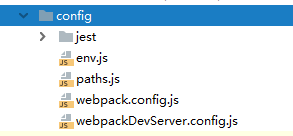
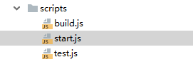

#npm install antd react-router --save-dev
#npm install echarts --save-dev
#npm install jquery --save-dev

--------------------------
脚手架自定义配置 https://www.jianshu.com/p/45ebcea63057
出现配置文件:
#npm run eject  

--------------------------

https://www.cnblogs.com/limitcode/p/7906447.html
1111
